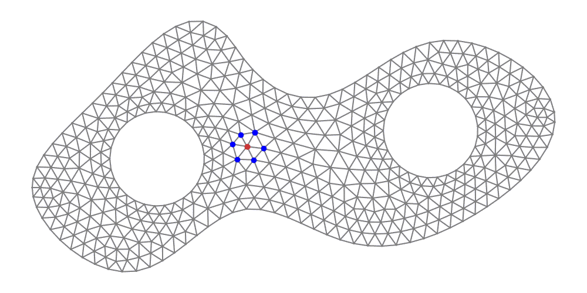
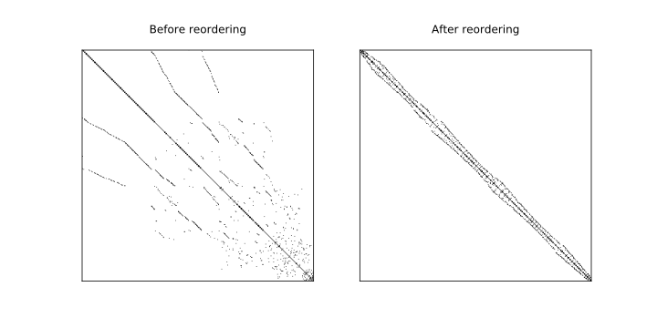

# GraphOrdering.jl

[![][travis-img]][travis-url]
[![][coveralls-img]][coveralls-url]

Package author: Jukka Aho (@ahojukka5)

GraphOrdering.jl is a package focused on a problem of renumbering vertices of a
graph such a way that the bandwidth of the sparse matrix is minimized. In other
words: find a permutation of system of equations which minimized the fill-in of
sparse matrix during matrix factorization. The functionality of the package
corresponds to the `symrcm` function of MATLAB.




## Usage

Consider the following graph:

       5--7--6
       |  | /
    4--8--2
    |  |  |
    9--1--3

```julia
G = Dict(
    1 => [9, 8, 3],
    2 => [6, 7, 8, 3],
    3 => [2, 1],
    4 => [8, 9],
    5 => [7, 8],
    6 => [7, 2],
    7 => [5, 6, 2],
    8 => [1, 2, 4, 5],
    9 => [4, 1])

result = symrcm(G, 9)
G2 = reorder(G, result)
bandwidth(G), bandwidth(G2)

# output

(17, 7)
```

That is, bandwidth is reduced from 17 to 7.

[travis-img]: https://travis-ci.org/ahojukka5/GraphOrdering.jl.svg?branch=master
[travis-url]: https://travis-ci.org/ahojukka5/GraphOrdering.jl
[coveralls-img]: https://coveralls.io/repos/github/ahojukka5/GraphOrdering.jl/badge.svg?branch=master
[coveralls-url]: https://coveralls.io/github/ahojukka5/GraphOrdering.jl?branch=master
